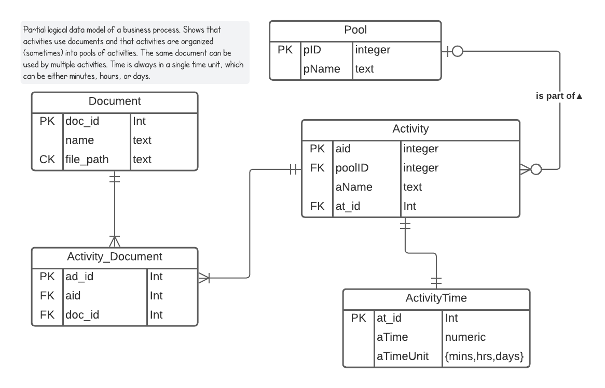
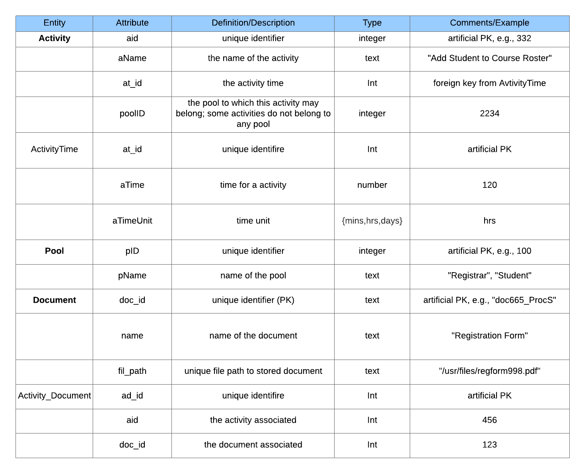

# HW2

I add a joint table Activity_Document between Document and Activity to break the many to many relationship. I also splitthe table ActivityTime out from Activity to break the possible transtive dependency aName -> aTime to make it in 3NF. I also changed the multiplicity from Activity to Pool from only one to zero or one, to match the description which says (sometimes) activities are organized into pools.

All fields are single valued and all tables have primary key, so the model is in 1NF.

There's no composite key, so no attribute depends on part of the composite key, so it's 2NF.

Document: the only non-prime arribute is name, so it's 3NF.

Activity_Document: aid and doc_id are foreign keys, and only depend on the primary key ad_id.

Pool: pName is the only non-prime attribute, so it's 3NF.

Activity: poolID and at_id are foreign keys, so only depend on aid. aName has no relation with the foreign keys and only depends on the primary key aid, so it's 3NF.

ActivityTime: aTime and aTimeUnit are independent on each other and only depend on the primary key at_id. So it's 3NF.

All entities are 3NF so the model is in 3NF.

Terms are revised to match the changes of the model.

