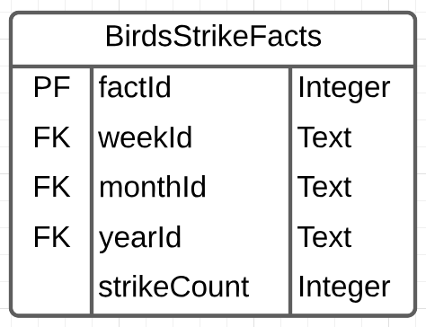

---
output:
  pdf_document: default
  html_document: default
---
## Question 1

A data warehouse can contain many star schemas. A star schema contains one fact table and several dimension tables. The fact table can be very large and contains pre-computed facts during ETL. For every dimension in a fact table, a single dimension table is associated with it. Relational data warehouse uses star schema to store pre-computation of derived date to streamline access for OLAP queries, provide selective redundancy to simplify and speed up queries for decision support and data mining.

Transactional database can be used to support OLAP with the help of star schema but shouldn't be used if there are better solutions. Although they are not the best to be used for OLAP, companies use transactional databases because they already have the infrastructure and people to design and maintain such databases. That being said, if building OLAP from the scratch, it's wiser to consider other databases that are ideal for this purpose like Columnar Databases.

## Question 2

Data warehouse is a centralized repository that stores data from various sources, cleanses and transforms it, and organizes it in a way that makes it suitable for business intelligence (BI) and analytical reporting. 

Data lakes are vast repositories where data is stored in its raw, unprocessed form. Unlike data warehouses, data lakes can hold structured, semi-structured, and unstructured data, offering flexibility in data storage and processing. They are particularly useful when dealing with large volumes of data that may not have a predefined structure.

Data marts are subsets of the data warehouse that are tailored to specific business departments or functions. The star schema's modular design makes it easy to create and maintain data marts that serve the unique analytical needs of different parts of the organization.

I don't have experience using them, but for example Netflix can use data warehouse to gather user information like which movie a person has watched and which movie a person like. It can then use them to analysis trends in the favor of movie and optimize movie inventory. Different department can access different aspect of the data ware house, like sales department and recommendation department at Netflix can each use a dedicated data mart for their needs. The movie files can be stored in a data lake. Other raw data can also be first stored in a data lake, and then sent to data warehouse after processing.

[article](https://aws.amazon.com/compare/the-difference-between-a-data-warehouse-data-lake-and-data-mart/)

## Question 3

In this fact table, I put number of strikes as element and time periods as dimensions. The table should be constructed by computing the number of strikes in each week. The month and year information is also recorded, so by simply summing up across multiple weeks in a month or year we can get the strike count of a month or a year. The average can also be derived by dividing the total count by a fixed number. 

References: 60.801 Key Concepts of Data Warehousing and OLAP, 12.0 | Overview / Analytics, Data Warehouses, Data Lakes, OLAP, and Star Schemas
